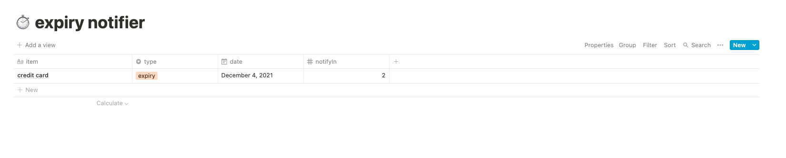
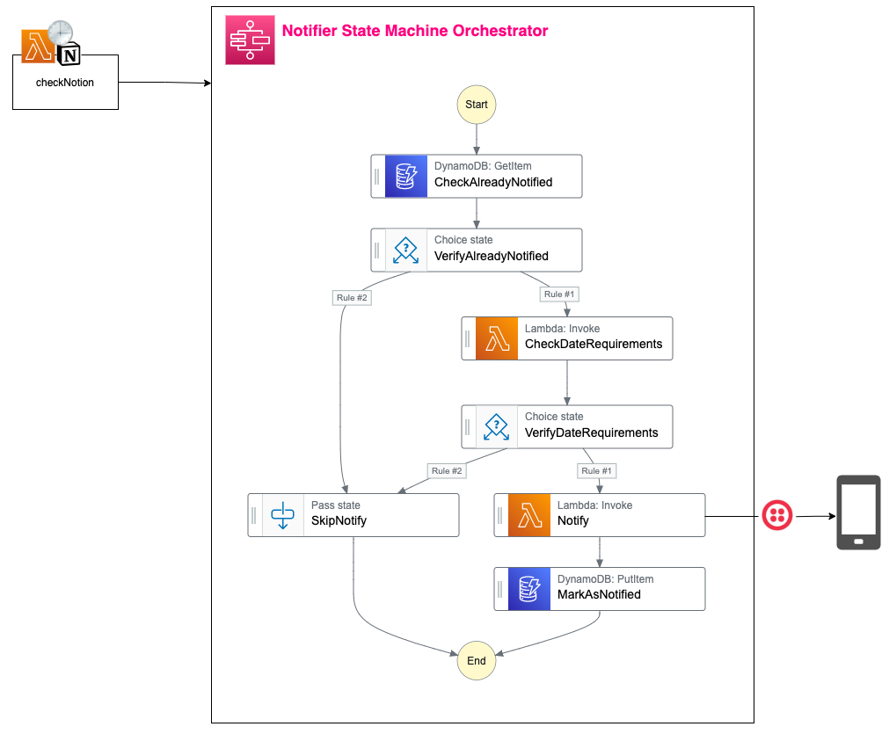

# ⏱ Expiry Notifier

## Description

Simple notification tool that sends early reminders via text message based on items from a Notion table. The primary use case is to remind events that can expire and is tedious/time consuming to renew (for ex: government ID's, passport).

Built with **Serverless with AWS (Step Functions, DynamoDB, Lambda), Notion API, and Twilio API**.

## Setup instructions

### **Notion Table:**

Create a Notion table with the following properties:

| Property   | Property Type | Required Field | Description                                |
| ---------- | ------------- | -------------- | ------------------------------------------ |
| `item`     | Text          | Yes            | the event you want to be reminded for.     |
| `type`     | Select        | No             | `expiry` or `reminder`; default: `expiry`. |
| `date`     | Date          | Yes            | due date/expiry date of item.              |
| `notifyIn` | Number        | No             | remind me in X months; default: `1`.       |

### **Parameters:**

The following parameters are required in AWS Systems Manager Parameter Store prior to stack deployment:

- `notion-token`: Notion's integration token. Refer to their API docs on how to set this up.
- `notion-database-id`: the unique identifier of the Notion table
- `twilio-auth-token`
- `twilio-account-sid`
- `twilio-phone-number`: the number used to send the text message
- `phone-number`: the number that will receive the text message

### **Installation/deployment:**

> **Requirements**: NodeJS `lts/fermium (v.14.15.0)`. If you're using [nvm](https://github.com/nvm-sh/nvm), run `nvm use` to ensure you're using the same Node version in local and in your lambda's runtime.

#### Using NPM:

- Run `npm i` to install the project dependencies
- Run `npx sls deploy` to deploy this stack to AWS

#### Using Yarn:

- Run `yarn` to install the project dependencies
- Run `yarn sls deploy` to deploy this stack to AWS

## Diagram

## How it works

1. On the first day of the month, `checkNotion` handler queries the Notion table via Notion API. Each item retrieved begins a Step Function execution.
2. Check DynamoDB store if the item has already been notified. If so, the execution ends early.
3. If the item has not been notified yet, check if the expiry date meets requirements. If it does not, the execution ends early.
4. If the expiry date meets requirements, a text message based on the type provided will be sent.
5. The item is marked as notified in DynamoDB.

## Improvements

### Security:

As MVP, this project was built with the assumption that the Notion table `item` property contains no sensitive information. With security in mind, a more restrictive measure should be taken to prevent AWS from reading the Step Functions data. Alex Fournier highlighted this in [his article](https://blog.theodo.com/2020/08/secure-aws-step-functions-sensitive-data/).

Instead of relying on the transmission of data between steps and retrieving it directly during their execution, a new DynamoDB table encrypted with external KMS keys can be created to store potentially sensitive data between steps.
